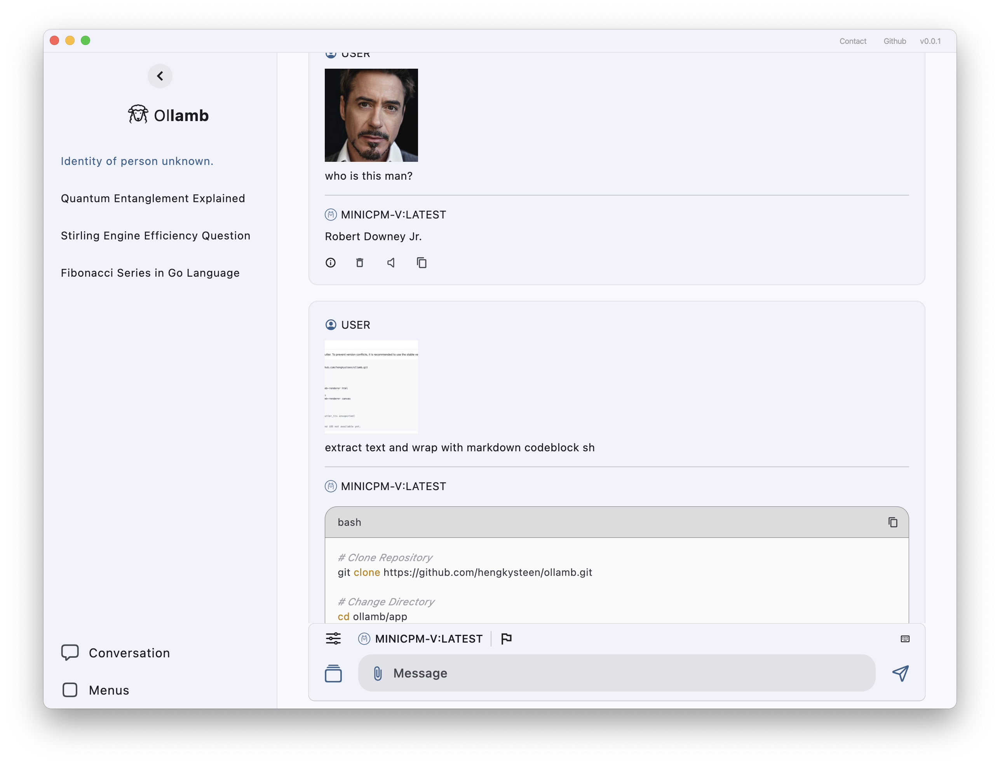
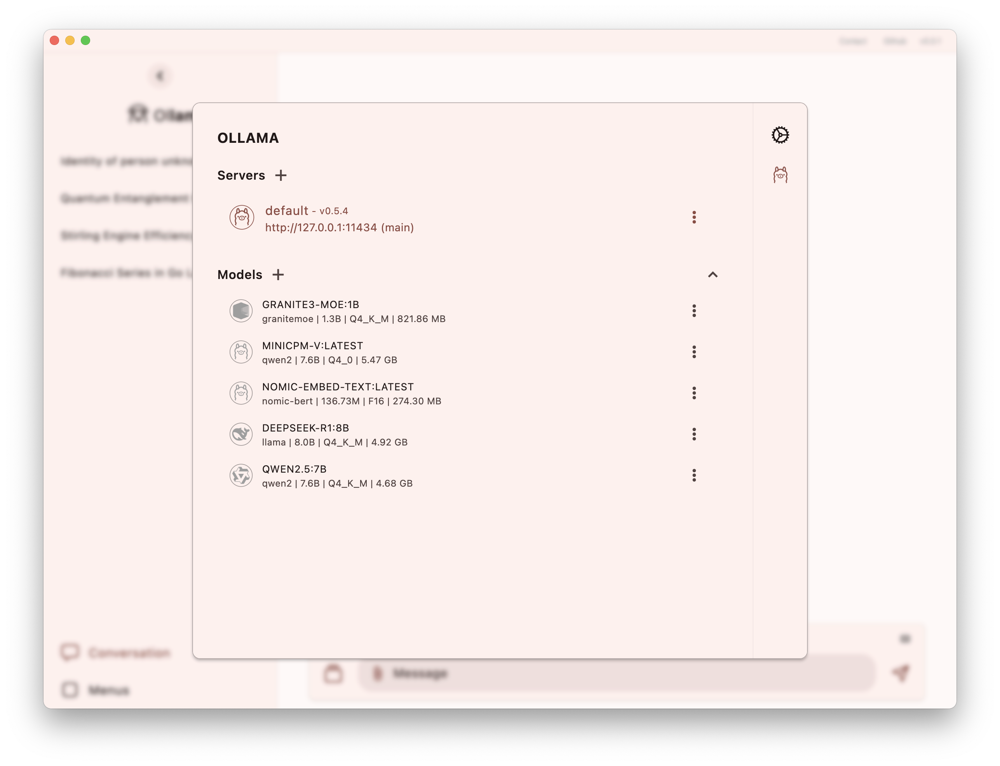
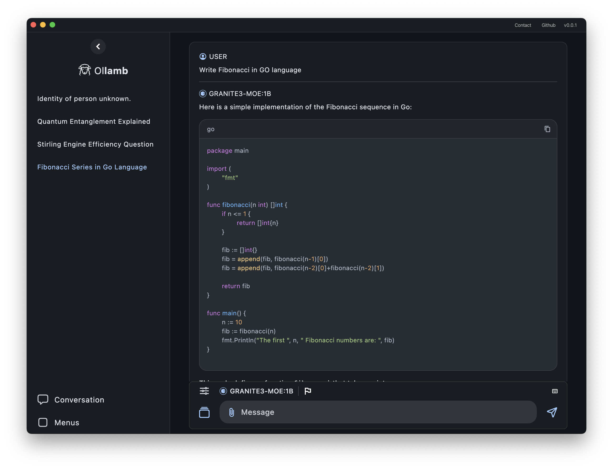
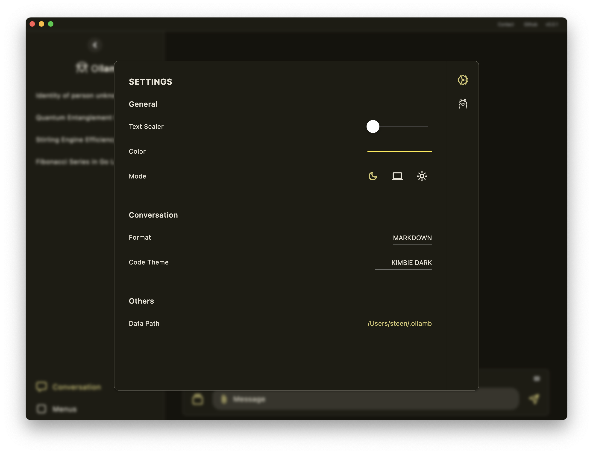

# Ollamb

A simple ollama client.

<p>




</P>

## Demo

[Web Demo](https://hengkysteen.github.io/demo/ollamb/)

To use this demo, set `OLLAMA_ORIGINS` to the demo URL.

```sh
# MacOs Example
launchctl setenv OLLAMA_ORIGINS "https://hengkysteen.github.io"
```

For other OS, refer to the [official documentation.](https://github.com/ollama/ollama/blob/main/docs/faq.md#how-do-i-configure-ollama-server)

## Build

This project is built with Flutter. To prevent version conflicts, it is recommended to use the stable version **v3.24.3**.

```sh
# Clone Repository
git clone https://github.com/hengkysteen/ollamb.git

# Change Directory
cd ollamb/app

# build for web html
flutter build web --web-renderer html

# build for web canvas
flutter build web --web-renderer canvas

# build for macos
flutter build macos

# build for linux (flutter_tts unsuported)
flutter build linux

# Windows, Android, and iOS not available yet.
```

## PreBuild

1. Go to the [Releases](https://github.com/hengkysteen/ollamb/releases/latest) page.
2. In assets list , Download the file you need:
   - **Ollamb-macos.zip** for macOS
   - **Ollamb-web.zip** for Web

### macOS

> Ollamb.app is from an unidentified developer.<br>
> It is safe to use but not notarized by Apple since it was built without an Apple Developer account.

1. Extract and run `Ollamb.app`.
2. Go to **System Settings > Privacy & Security**.
3. In the **Security** section, tap `Open Anyway`, then confirm by tapping `Open`.

### Web

Extract the archive and run it using any local HTTP server.

```sh
# Example using npm http-server
cd Ollamb-web
http-server
```
